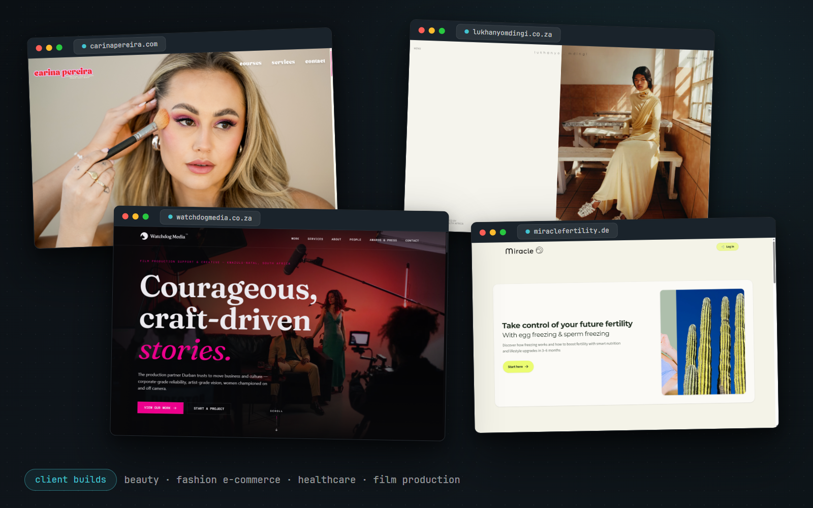
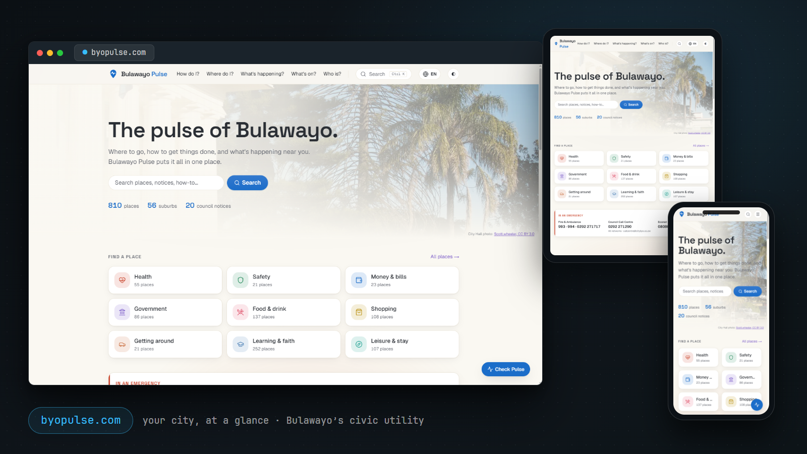
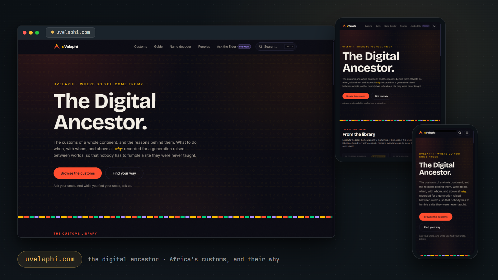
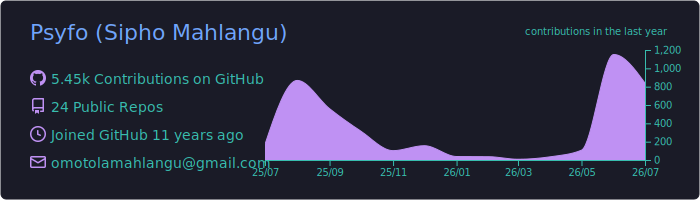
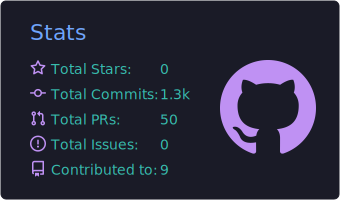
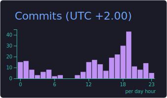
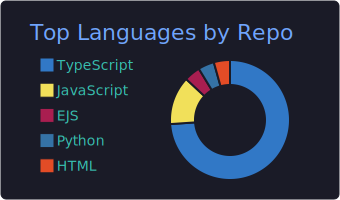
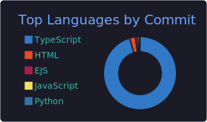

<!-- markdownlint-disable MD033 -->
<h1 align="center">Sipho Omotola Mahlangu</h1>

  Senior Full Stack Engineer&nbsp;&middot;&nbsp;AI Engineering&nbsp;&middot;&nbsp;Distributed Systems

  
  &nbsp;
  
  &nbsp;
  
  &nbsp;
  

---

## About

Senior full stack engineer with 10+ years designing and operating high-throughput, distributed systems in cloud-native environments. I specialise in event-driven architectures, real-time data platforms, and scalable backend systems. Currently focused on AI-enabled applications and agentic systems, combining large language models, knowledge-driven workflows, and solid backend platforms.

**Client builds** (private repos, live sites): [carinapereira.com](https://carinapereira.com) · [lukhanyomdingi.co.za](https://lukhanyomdingi.co.za) · [miraclefertility.de](https://miraclefertility.de) · [watchdogmedia.co.za](https://watchdogmedia.co.za)

  

---

## Skills

**Backend & Systems**

**AI Engineering**

**Cloud & Infrastructure**

**Data & Storage**

**Frontend**

---

## Areas of Interest

- **AI Engineering & Agentic Systems:** building AI-native software, agentic workflows, retrieval and knowledge graphs, and LLMs wired into real backend systems, with explainability and human oversight designed in.
- **Distributed Systems & Real-Time Data:** event-driven architectures, streaming pipelines, and the operational discipline that keeps high-throughput systems reliable at scale.
- **Personal curiosities:** Web3 and decentralised infrastructure, applied statistics, and local-first AI, explored off the clock.

---

## Projects

### BYO Pulse · [byopulse.com](https://byopulse.com)

Bulawayo's civic utility: your city, at a glance. It aggregates official city information so a resident can answer *Where do I go? Who do I call? How do I do this? What's happening nearby?* fast, on any phone, without an account: a directory of 800+ mapped places, City of Bulawayo notices, events, quick how-tos, and per-suburb pages.

- **How the agent behaves.** *Ask Byo* answers only from the site's own sourced data and is built so it cannot invent information: when the answer is not in that data it says so and routes you back to search instead of guessing, answers are plain text with links stripped out, and sources render as tap-through chips drawn only from the retrieval set the app controls. It is also engineered to stay free to run: each distinct question is answered once and then cached (refusals included), a global daily budget caps spend far inside the provider's free tier, an empty search refuses without spending anything, and any outage degrades to plain search instead of an error. It never fires on its own, only on an explicit tap.
- **How information stays trustworthy.** Provenance is the product: every surface shows its source and the date it was last checked, and anything that can't be confirmed is left out rather than guessed (*a miss beats a mismatch*). The AI is given autonomy in proportion to how safely its output can be checked: machine-validated facts write straight through, mechanical data updates auto-merge behind the full test suite, and contested civic facts (who holds a council seat, dam levels) always wait for a human. On its first live run the validation gate correctly rejected 2 of 26 notices for tagging a suburb the dataset doesn't carry, exactly the error class it was built for, and community submissions render only after a moderator approves them.
- **How it's engineered to run.** The data layer is a fixed, pre-built base with a live overlay merged on top at read time, so the production build never needs a secret (CI runs with zero credentials), and if the database ever disappears the site simply serves the last good version instead of breaking; approved edits go live in about ten seconds without a deploy. The daily refresh is fully autonomous: because bot-opened pull requests don't trigger CI, the workflow re-runs the exact test gate itself, reports it as the required check, and merges, with any failure leaving the PR open for a human and branch protection untouched. Every autonomous surface is pinned by 69 automated test cases on every build, the whole automation estate runs on a single read-only secret, and the entire stack sits on free tiers at effectively zero cost.

`Next.js` · `TypeScript` · `Tailwind CSS` · `Neon Postgres + Drizzle` · `Groq (Llama 3.3 70B)` · `Leaflet / OpenStreetMap` · `GitHub Actions` · `Doppler` · `Vercel` &nbsp;·&nbsp; *source private, product public*

### uVelaphi · [uvelaphi.com](https://uvelaphi.com)

The Digital Ancestor: the customs of a continent, recorded for a generation raised between worlds. 1,100+ entries across customs, names, dishes, and garments answer what to do, when, with whom, and above all *why*, with a guided path that narrows a continent of customs down to your moment and a Name Decoder for what any African name carries.

- **What it answers.** Customs are treated as processes, not articles: every entry lays out the steps, the roles (who initiates, who mediates, who receives), the timing, and above all the reason, answering four questions at once, what to do, when and with whom, why, and what everyone else is doing so you can show up at any ceremony informed and calm. Alongside the library sit a guided path that narrows the continent's customs down to your situation and a Name Decoder that reads the meaning, totem, and praise lines behind any African name.
- **How the agent behaves.** A research pipeline drafts entries, and every machine draft is labeled *AI-aggregated*; it never masquerades as verified knowledge. *Ask the Elder*, the conversational surface, ships as a clearly labeled preview that speaks from a model rather than the verified corpus, and it points users back to the library.
- **How information is curated.** Every claim wears its badge on a trust ladder it must climb: **AI-aggregated** (drafted by the pipeline) → **Community-affirmed** (endorsed or corrected by people of that culture) → **Elder-verified** (cited to a named knowledge holder, with consent). A step without a why is flagged incomplete, never papered over. Guidance, not enforcement; unverified content is always labeled.

*source private, product public*

---

## GitHub Stats

<!--
  The summary cards below are generated by .github/workflows/profile-summary-cards.yml and
  committed to profile-summary-card-output/ on main, rather than hotlinked from the public
  github-profile-summary-cards instance (which started returning 500 FUNCTION_INVOCATION_FAILED
  for every user, and took the cards down with it). Same reason github-readme-stats.vercel.app
  is not here: that instance has been 503 DEPLOYMENT_PAUSED since 2026-07-13. Generating into
  the repo means an outage on someone else's Vercel project can no longer blank this section.

  Three of the five cards generate with the built-in token. The other two (profile-details
  and stats) read user-level data and need a PAT; see the commented block below.

  A self-hosted github-readme-stats with a PAT is still the only way to count private-repo
  work; these cards cover public activity only.
-->

  

<!--
  The profile-details and stats cards are commented out because the workflow cannot
  generate them with the built-in GITHUB_TOKEN: both read user-level data and fail with
  "Resource not accessible by integration". They need a PAT (public_repo + read:user)
  added as the SUMMARY_GITHUB_TOKEN repo secret, which the workflow already prefers when
  present. Once it is set and the workflow has run, uncomment these two:

  

    
  

  
-->

  

  
  

  

  

<!--
  Contribution-snake animation. The SVGs are generated by .github/workflows/snake.yml
  and pushed to the `output` branch; they populate on the first workflow run (which
  triggers on push to main, so within ~a minute of this landing on the default branch)
  and refresh daily. Until that first run the two images below are blank.
-->

  <picture>
    <source media="(prefers-color-scheme: dark)" srcset="https://raw.githubusercontent.com/Psyfo/psyfo/output/github-snake-dark.svg" />
    <source media="(prefers-color-scheme: light)" srcset="https://raw.githubusercontent.com/Psyfo/psyfo/output/github-snake.svg" />
    
  </picture>

---

## Connect

- Email: [omotolamahlangu@gmail.com](mailto:omotolamahlangu@gmail.com)
- Website: [mahlangu.dev](https://mahlangu.dev)
- LinkedIn: [linkedin.com/in/sipho-mahlangu](https://www.linkedin.com/in/sipho-mahlangu/)
<!-- markdownlint-enable MD033 -->
